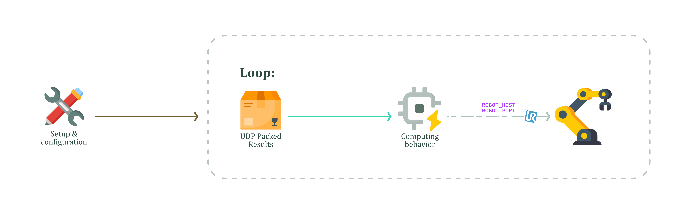

# Controller Submodule: A Module For Controlling Robots' Behavior
This module is the core of the robot-side application within the [**EdgeCV4Safety**](https://github.com/justwhiteecode/EdgeCV4Safety.git) project. 
Its primary responsibility is to receive real-time distance data from the Computer Vision node via UDP and translate it into safe speed commands for a Universal Robot (UR).

The communication with the robot is handled using the [**RTDE** (Real-Time Data Exchange) protocol library](https://github.com/UniversalRobots/RTDE_Python_Client_Library.git), 
which allows for high-frequency and low-latency control of the robot's parameters, such as the `speed_slider_fraction`.

_In general, this submodule can be modified to achieve other behaviors or even to use other communication protocols, such as Modbus or the OPC family._

<br>

## File Breakdown 📂
This module consists mainly of three Python scripts and one XML configuration file; other components are part of the RTDE library (`rtde/` and `rtde_examples`).

The `SpeedControllerUDP.py` and `SlowedSpeedControllerUDP.py` are similar and work more or less in the same way:
1) **UDP Listener**: It starts a `udp_listener.py` subprocess to listen for incoming distance data on a specific IP and port.
2) **RTDE Connection**: It establishes and maintains a persistent RTDE connection with the UR robot controller. The script is designed to be robust, automatically attempting to reconnect if the connection is lost.
3) **Data Processing**: It reads the latest distance value from a thread-safe queue populated by the UDP listener.
4) **Speed Calculation**: It uses the `calculate_speed_fraction()` function to map the distance in meters to a corresponding speed fraction (from 0.0 for 0% speed to 1.0 for 100% speed).
5) **Robot Command**: It sends the calculated speed fraction to the robot's `speed_slider_fraction` register via RTDE. All documentation about internal robot configuration is available [here](https://docs.universal-robots.com/tutorials/communication-protocol-tutorials/rtde-guide.html).

<p align="center">
  
  <br>
  <i>Fig. 1 - Functional Flow of the Controller submodule</i>
</p>

The difference between the two scripts is their behavior in changing the robot speed:
- In the `SpeedControllerUDP.py`, speed adjustments are immediate and directly reflect the most recently received distance. This provides a highly reactive system, but also highly sensitive to false estimations.
- In the `SlowedSpeedControllerUDP.py`, a counter-based filtering logic is implemented to prevent jerky movements caused by noisy estimation data or single-frame detection outliers. If the system receives a distance that requires a slower speed, it must receive this command for `MIN_TIMES_LOW` consecutive cycles before the speed is actually reduced. This prevents sudden, unnecessary stops if a person briefly walks by far away. If the system receives a distance that allows for a faster speed, it must receive this command for `MIN_TIMES_HIGH` consecutive cycles. This ensures the robot only accelerates when the path is confirmed to be clear for a sustained period. This controller results in a much smoother and more predictable robot motion, prioritizing safety over instant reactivity. A good bilancement consists of lower `MIN_TIMES_LOW` and higher `MIN_TIMES_HIGH`. Those parameters are fully customizable.

The `recipe.xml` defines the **data exchange "contract"** between our Python scripts and the UR robot controller. It specifies exactly which data variables we want to read from the robot and which ones we want to write to it.
* `<recipe key="in">` (**Input to the Robot**): This section defines the data our script sends to the robot according to the [documentation](https://docs.universal-robots.com/tutorials/communication-protocol-tutorials/rtde-guide.html).
  In our use case, `speed_slider_mask` is a boolean flag (sent as an integer 1) that tells the robot we want to take control of the speed slider, and `speed_slider_fraction` represents the current speed value, which is a DOUBLE (float) between 0.0 (0%) and 1.0 (100%).
* `<recipe key="out">` (**Output from the Robot**): This section defines the data our script receives from the robot, mainly for monitoring and debugging.
  In our use case, we read `actual_TCP_speed`, the current measured speed of the robot's tool center point, and `target_TCP_speed`, the speed the robot is currently trying to achieve.

<br>

The `dummyListener.py`  is a simple, standalone script designed for **debugging and testing** purposes only.

How it works:
- It binds to the same IP and port as the CV node sender.
- It waits for incoming UDP packets, unpacks the floating-point distance value, and prints it to the console.

The primary purpose of this tool is to verify that the Computer Vision node is correctly calculating and sending distance data before attempting to connect to the actual robot. This helps isolate problems between the two systems.

<br>

## Configuration and Usage 🛠️
The scripts require the **official Universal Robots RTDE Python library**.

Almost all main parameters are located at the top of `SpeedControllerUDP.py` and `SlowedSpeedControllerUDP.py`:
* `ROBOT_HOST`: The IP address of the UR robot.
* `ROBOT_PORT`: The RTDE port of the robot (default is 30004).
* `CONFIG_XML`: The path to the XML recipe file.
* `VELOCITY_THRESHOLD_*`: These constants define the mapping between distance intervals and the desired robot speed.
* `RTDE_FREQUENCY`: It reflects the frequency (Hz) of RTDE communication ([check](https://docs.universal-robots.com/tutorials/communication-protocol-tutorials/rtde-guide.html#rtde-control-package-pause) maximum frequency supported, typically 125 or even 500 Hz).

Other parameters for listening are located at the beginning og `udp_listener.py`:
* `LISTEN_IP`: It must correspond to TARGET_NODE_IP in the Computer Vision node or could be 0.0.0.0 to listen on all interfaces available.
* `LISTEN_PORT`: It have to correspond to TARGET_NODE_PORT of the Computer Vision node.

<br>

## Running the Controller ▶️
To run the system, execute one of the controller scripts from the terminal in the same directory as the scripts. Ensure the `udp_listener.py` script is in the same directory.
```bash
# To run the reactive controller
python3 SpeedControllerUDP.py

# To run the smoothed/safer controller
python3 SlowedSpeedControllerUDP.py
```

<br>

---

## Credits 🤝
System Coordination and Implementation by Matteo Fontolan.

# Acknowledgements and Licenses

This project is built upon the incredible work of several projects and research teams. We gratefully acknowledge their contributions.
